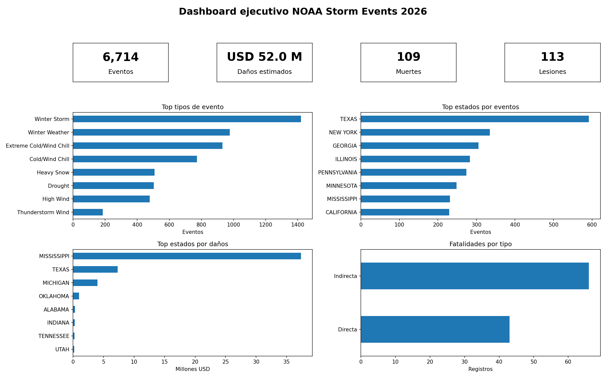

# analisis-eventos-NOAA

Proyecto de análisis reproducible sobre eventos meteorológicos severos y desastres naturales registrados por NOAA/NCEI Storm Events.

Este repo nace como una exploración que hice en su momento sobre datos del NOAA del año 2024 y evoluciona hacia un proyecto de portfolio profesional de análisis de datos: reproducible, testeado, modular y ejecutable desde línea de comandos.

## Objetivo

Construir un flujo reproducible para:

- descargar datos RAW oficiales de NOAA/NCEI;
- detectar automáticamente los últimos archivos publicados por año;
- limpiar y validar los datasets principales;
- generar archivos procesados listos para análisis exploratorio y visualización;
- mantener una base clara para Power BI y futuras etapas analíticas.


## Fuente de datos

Fuente oficial:

- NOAA/NCEI Storm Events Database
- Bulk CSV index: https://www.ncei.noaa.gov/pub/data/swdi/stormevents/csvfiles/
- Documentación del formato bulk: https://www.ncei.noaa.gov/pub/data/swdi/stormevents/csvfiles/Storm-Data-Bulk-csv-Format.pdf
- README oficial: https://www.ncei.noaa.gov/pub/data/swdi/stormevents/csvfiles/README

NOAA publica archivos bulk en formato CSV comprimido. En este proyecto se usan los tres archivos principales por año:

- `StormEvents_details-ftp_v1.0_dYYYY_cYYYYMMDD.csv.gz`
- `StormEvents_locations-ftp_v1.0_dYYYY_cYYYYMMDD.csv.gz`
- `StormEvents_fatalities-ftp_v1.0_dYYYY_cYYYYMMDD.csv.gz`

Donde:

- `dYYYY` representa el año de datos.
- `cYYYYMMDD` representa la fecha de creación/publicación del archivo.
- `details`, `locations` y `fatalities` se relacionan mediante `EVENT_ID`.

## Estado actual

El proyecto permite ejecutar un flujo completo:

```bash
uv run noaa-descargar --anio 2026 --raw-dir data/raw

uv run noaa-procesar \
  --raw-dir data/raw \
  --anio 2026 \
  --salida data/processed

make check
```

Estado verificado localmente:

```text
uv run noaa-descargar -> descarga los 3 RAW oficiales
uv run noaa-procesar  -> genera los 3 CSV limpios
make check             -> ruff + pytest
pytest                 -> 65 passed
```

Resultado esperado:

```text
data/raw/
├── StormEvents_details-ftp_v1.0_d2026_cYYYYMMDD.csv.gz
├── StormEvents_locations-ftp_v1.0_d2026_cYYYYMMDD.csv.gz
└── StormEvents_fatalities-ftp_v1.0_d2026_cYYYYMMDD.csv.gz

data/processed/
├── StormEvents_details_Limpio.csv
├── StormEvents_locations_Limpio.csv
└── StormEvents_fatalities_Limpio.csv
```
## Vista ejecutiva




## Stack técnico

- Python 3.11+
- pandas
- httpx
- uv
- ruff
- pytest
- Makefile
- Power BI

## Instalacion

Clonar el repositorio:

```bash
git clone https://github.com/Sinnick4r/analisis-eventos-NOAA.git
cd analisis-eventos-NOAA
```

Sincronizar entorno y dependencias:

```bash
uv sync
```

Verificar instalación:

```bash
make check
```

## Uso

### 1. Descargar datos RAW oficiales

```bash
uv run noaa-descargar --anio 2026 --raw-dir data/raw
```

El comando consulta el índice oficial de NOAA/NCEI, detecta los últimos archivos disponibles para el año indicado y descarga:

- `details`
- `locations`
- `fatalities`

Los archivos se guardan en `data/raw/`.

### 2. Procesar datos descargados

```bash
uv run noaa-procesar \
  --raw-dir data/raw \
  --anio 2026 \
  --salida data/processed
```

El comando detecta los últimos RAW locales para el año indicado, ejecuta las validaciones y genera los CSV procesados en `data/processed/`.

### 3. Ejecutar controles de calidad

```bash
make check
```

Equivale a:

```bash
uv run ruff check .
uv run pytest
```

## Comandos disponibles

| Comando | Descripción |
|---|---|
| `uv run noaa-descargar --anio 2026 --raw-dir data/raw` | Descarga RAW oficiales desde NOAA/NCEI. |
| `uv run noaa-procesar --raw-dir data/raw --anio 2026 --salida data/processed` | Procesa RAW locales y genera CSV limpios. |
| `make lint` | Ejecuta Ruff. |
| `make test` | Ejecuta pytest. |
| `make check` | Ejecuta lint + tests. |

## Estructura del repositorio

```text
.
├── config/
├── data/
│   ├── raw/              # RAW descargados, ignorados por Git
│   ├── processed/        # CSV procesados, ignorados por Git
│   └── samples/
├── docs/
│   └── decisiones/
├── legacy/
├── notebooks/
├── reports/
│   ├── powerbi/
│   └── validacion/
├── src/
│   └── noaa_eventos/
│       ├── archivos_noaa.py
│       ├── cli.py
│       ├── cli_descarga.py
│       ├── descarga_noaa.py
│       ├── danios.py
│       ├── flujo.py
│       ├── io.py
│       ├── limpieza.py
│       ├── procesamiento_details.py
│       ├── procesamiento_fatalities.py
│       ├── procesamiento_locations.py
│       └── validacion.py
├── tests/
├── pyproject.toml
├── uv.lock
├── Makefile
└── README.md
```

## Arquitectura del flujo

```text
NOAA/NCEI HTTP index
        ↓
detección de último archivo por año y tipo
        ↓
descarga de RAW .csv.gz
        ↓
data/raw/
        ↓
lectura con pandas
        ↓
normalización de columnas
        ↓
limpieza de strings vacíos
        ↓
validaciones de contrato
        ↓
conversión de daños K/M/B
        ↓
data/processed/
        ↓
Power BI / análisis exploratorio
```

## Módulos principales

| Módulo | Responsabilidad |
|---|---|
| `archivos_noaa.py` | Parseo y selección de nombres oficiales NOAA. |
| `descarga_noaa.py` | Consulta del índice HTTP y descarga de RAW. |
| `cli_descarga.py` | CLI para descarga de RAW oficiales. |
| `cli.py` | CLI de procesamiento local. |
| `flujo.py` | Orquestación del procesamiento local. |
| `io.py` | Lectura y escritura de CSV. |
| `limpieza.py` | Normalización de columnas y limpieza básica. |
| `danios.py` | Conversión de daños NOAA con sufijos `K`, `M`, `B`. |
| `validacion.py` | Validaciones reutilizables de contratos de datos. |
| `procesamiento_details.py` | Procesamiento del dataset `details`. |
| `procesamiento_locations.py` | Procesamiento del dataset `locations`. |
| `procesamiento_fatalities.py` | Procesamiento del dataset `fatalities`. |

## Validaciones implementadas

### Generales

- existencia de columnas obligatorias;
- ausencia de nulos en columnas críticas;
- unicidad de claves cuando corresponde;
- no mutación de DataFrames originales;
- errores explícitos ante formatos inválidos.

### Details

Validaciones mínimas:

- `event_id`
- `episode_id`
- `event_type`
- `state`
- `begin_date_time`
- `end_date_time`

Transformaciones:

- normalización de nombres de columnas;
- limpieza de strings vacíos;
- conversión de `damage_property`;
- conversión de `damage_crops`.

### Locations

Validaciones mínimas:

- `event_id`
- `location_index`

Regla de clave:

- `event_id` no es único globalmente;
- la clave operativa validada es `event_id + location_index`.

### Fatalities

Validaciones mínimas:

- `fatality_id`
- `event_id`
- `fatality_type`
- `fatality_date`

Regla de clave:

- `fatality_id` debe ser único.

## Convenciones de datos

Los archivos RAW descargados desde NOAA/NCEI se conservan sin modificación en:

```text
data/raw/
```

Los archivos procesados se generan en:

```text
data/processed/
```

Ambas carpetas están ignoradas por Git para evitar versionar archivos pesados o generados.

## Testing

El proyecto usa `pytest`.

Ejecutar tests:

```bash
uv run pytest
```

Ejecutar lint:

```bash
uv run ruff check .
```

Ejecutar todo:

```bash
make check
```

Estado actual verificado:

```text
65 passed
```

## Decisiones de diseño

### Mantener nombres en español

El proyecto conserva nombres de funciones, módulos internos y documentación en español. Esta decisión es intencional: preserva la historia del proyecto y lo mantiene alineado con su objetivo de portfolio personal/profesional.

### Separar descarga y procesamiento

La descarga y el procesamiento son comandos separados:

```bash
uv run noaa-descargar ...
uv run noaa-procesar ...
```

Esto permite conservar el RAW como snapshot auditable antes de generar datos procesados.

### No usar notebooks como producción

Los notebooks pueden usarse para exploración, pero la lógica reutilizable vive en `src/noaa_eventos/`.

### No agregar ML todavía

El proyecto no incluye modelos predictivos. Antes de avanzar hacia ML, se prioriza cerrar contratos de datos, reproducibilidad, validación y visualización.

## Power BI

El archivo Power BI original se conserva como parte de la etapa exploratoria del proyecto.

La salida moderna esperada para Power BI son los CSV procesados:

```text
data/processed/StormEvents_details_Limpio.csv
data/processed/StormEvents_locations_Limpio.csv
data/processed/StormEvents_fatalities_Limpio.csv
```

Modelo sugerido:

```text
details.event_id 1 - * locations.event_id
details.event_id 1 - * fatalities.event_id
```

## Alcance actual

Incluido:

- descarga oficial desde NOAA/NCEI;
- detección automática de últimos archivos por año;
- procesamiento de `details`, `locations`, `fatalities`;
- validaciones mínimas de contratos;
- conversión de daños;
- CLI reproducible;
- tests automatizados;
- estructura modular.

No incluido por ahora:

- automatización mensual con GitHub Actions;
- almacenamiento cloud;
- base de datos;
- dashboard Power BI final rediseñado;
- modelo de machine learning;
- cruce con fuentes externas.

## Roadmap cercano

### Prioridad alta

- agregar `.gitattributes` para normalizar finales de línea;
- agregar un reporte simple de validación de outputs;
- revisar visualización Power BI con los CSV procesados actuales.

### Prioridad media

- agregar GitHub Actions para `ruff` y `pytest`;
- mejorar reporte de validación;
- agregar diccionario de datos propio;
- documentar modelo Power BI.

### Prioridad baja

- automatizar actualización mensual;
- agregar fuentes externas;
- migrar outputs a formato Parquet;
- incorporar análisis geoespacial;
- evaluar hipótesis o modelos predictivos.

## Historia del proyecto

Este repositorio empezó como una exploración de datos NOAA 2024 en contexto de aprendizaje. La modernización no borra esa etapa: la toma como base y la transforma en un proyecto profesional, reproducible y defendible en portfolio.

El objetivo es mostrar evolución técnica:

```text
exploración inicial
    ↓
limpieza y validación
    ↓
modularización
    ↓
testing
    ↓
CLI reproducible
    ↓
pipeline con RAW oficiales
    ↓
análisis y visualización
```

## Licencia y uso de datos

Los datos pertenecen a NOAA/NCEI. Este repositorio contiene código de procesamiento y análisis; no versiona los datasets RAW ni procesados.

Consultar las condiciones y documentación oficial en:

- https://www.ncei.noaa.gov/stormevents/
- https://www.ncei.noaa.gov/pub/data/swdi/stormevents/csvfiles/
